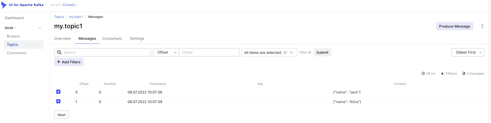

# Heizer
A python library to easily create kafka producer and consumer

## Install

```shell
pip install heizer
```

## Setup
Use `docker-compose.yaml` file to start kafka service

```shell
docker-compose up -d
```

## Sample

### Producer

```python
from heizer import HeizerConfig, HeizerTopic, producer

producer_config = HeizerConfig(
    {
        "bootstrap.servers": "localhost:9092",
    }
)

my_topics = [
    HeizerTopic(name="my.topic1", partitions=[0]),
    HeizerTopic(name="my.topic2", partitions=[0, 1]),
]


@producer(
    topics=my_topics,
    config=producer_config,
)
def my_producer(my_name: str):
    return {
        "name": my_name
    }


if __name__ == "__main__":
    my_producer("Jack")
    my_producer("Alice")

```



### Consumer

```python
from heizer import HeizerConfig, HeizerTopic, consumer, producer
from confluent_kafka import Message
import json

producer_config = HeizerConfig(
    {
        "bootstrap.servers": "localhost:9092",
    }
)

consumer_config = HeizerConfig(
    {
        "bootstrap.servers": "localhost:9092",
        "group.id": "default",
        "auto.offset.reset": "earliest",
    }
)

topics = [HeizerTopic(name="my.topic1")]


@producer(
    topics=topics,
    config=producer_config
)
def produce_data(status: str, result: str):
    return {
        "status": status,
        "result": result,
    }


# Heizer expects consumer stopper func return Bool type result
# For this example, consumer will stop and return value if 
# `status` is `success` in msg
# If there is no stopper func, consumer will keep running forever
def stopper(msg: Message):
    data = json.loads(msg.value().decode("utf-8"))
    if data["status"] == "success":
        return True

    return False


@consumer(
    topics=topics,
    config=consumer_config,
    stopper=stopper,
)
def consume_data(message):
    data = json.loads(message.value().decode("utf-8"))
    print(data)
    return data["result"]


if __name__ == "__main__":
    produce_data("start", "1")
    produce_data("loading", "2")
    produce_data("success", "3")
    produce_data("postprocess", "4")

    result = consume_data()

    print("Expected Result:", result)

```

After you executed this code block, you will see those output on your terminal

```shell
{'status': 'start', 'result': '1'}
{'status': 'loading', 'result': '2'}
{'status': 'success', 'result': '3'}

Expected Result: 3

```
